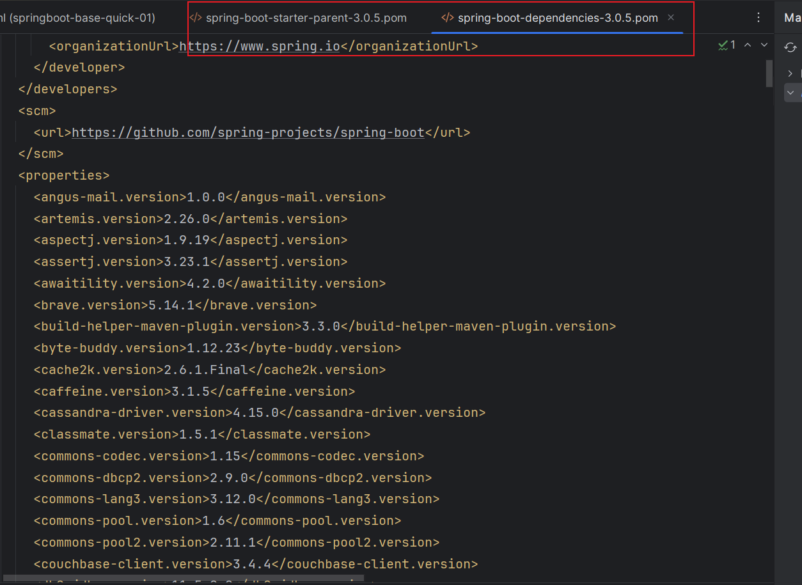

# SpringBoot 简介以及快速使用

# 一 简介

​	SSM已经能够帮助极大的提高了我们的开发效率，为什么还会出现SpringBoot呢？

​	SSM是帮助我们提高了很大的开发效率，但是回想起来SSM的配置很多。要想写个web项目，需要引用很多依赖并且需要很多配置。这里就有两个问题，依赖会冲突，配置很麻烦。Spingboot的出现解决了复杂繁琐的配置以及依赖版本的控制，以便程序员更快速的开发项目。实现这个思想是**约定大于配置**。

**SpringBoot 帮我们简单、快速地创建一个独立的、生产级别的 **Spring 应用（说明：SpringBoot底层是Spring）**，大多数 SpringBoot 应用只需要编写少量配置即可快速整合 Spring 平台以及第三方技术！**


# 二 快速使用

## 2.1 系统要求

Springboot3的要求

|           |                                 |
| --------- | ------------------------------- |
| 技术&工具 | 版本（or later）                |
| maven     | 3.6.3 or later 3.6.3 或更高版本 |
| Tomcat    | 10.0+                           |
| Servlet   | 9.0+                            |
| JDK       | 17+                             |

## 2.2 使用

> 场景： 浏览器发送/hello请求。在浏览器上返回hello Springboot3 ！

1. 开发步骤
   1. **创建Maven工程**
   2. **添加依赖(springboot父工程依赖 , web启动器依赖)**
   3. **编写启动引导类(springboot项目运行的入口)**
   4. **编写处理器Controller**
   5. **启动项目**

**添加依赖**

a. 添加springboot父工程依赖。

SpringBoot可以帮我们方便的管理项目依赖 , 在Spring Boot提供了一个名为**spring-boot-starter-parent**的工程，里面已经对各种常用依赖的版本进行了管理，我们的项目需要以这个项目为父工程，这样我们就不用操心依赖的版本问题了，需要什么依赖，直接引入坐标(不需要添加版本)即可！

```xml
<parent>
            <groupId>org.springframework.boot</groupId>
            <artifactId>spring-boot-starter-parent</artifactId>
            <version>3.0.5</version>
</parent>
```


b. 添加web启动器

为了让Spring Boot帮我们完成各种自动配置，我们必须引入Spring Boot提供的自动配置依赖，我们称为启动器。因为我们是web项目，这里我们引入web启动器。

```xml
 <!--web开发的场景启动器-->
        <dependency>
            <groupId>org.springframework.boot</groupId>
            <artifactId>spring-boot-starter-web</artifactId>
        </dependency>
```

c. 编写启动类

com.ls

```java
/**
 * @SpringBootApplication是一个特殊的注解，用于标识一个Spring Boot应用程序的入口类。它的主要作用是将三个常用注解组合在一起，简化了配置的过程。
 *
 * 具体而言，@SpringBootApplication注解包含以下三个注解的功能：
 *     @Configuration：将该类标识为应用程序的配置类。它允许使用Java代码定义和配置Bean。
 *     @EnableAutoConfiguration：启用Spring Boot的自动配置机制。它根据项目的依赖项自动配置Spring应用程序的行为。自动配置根据类路径、注解和配置属性等条件来决定要使用的功能和配置。
 *     @ComponentScan：自动扫描并加载应用程序中的组件，如控制器、服务、存储库等。它默认扫描@SpringBootApplication注解所在类的包及其子包中的组件。
 *
 * 使用@SpringBootApplication注解，可以将上述三个注解的功能集中在一个注解上，简化了配置文件的编写和组件的加载和扫描过程。它是Spring Boot应用程序的入口点，标识了应用程序的主类
 * 并告诉Spring Boot在启动时应如何配置和加载应用程序。
 */
@SpringBootApplication
public class MainApplication {

    //SpringApplication.run() 方法是启动 Spring Boot 应用程序的关键步骤。它创建应用程序上下文、
    // 自动配置应用程序、启动应用程序，并处理命令行参数，使应用程序能够运行和提供所需的功能
    public static void main(String[] args) {
        SpringApplication.run(MainApplication.class,args);

    }
}
```

* springboot的启动位置，传参数进行配置。
* 该启动类的位置即所在包的所有包都会交给springboot管理。

d. 编写controller

com.ls.controller

```java
@RequestMapping("/hello")
@Controller
public class HelloController {
    @GetMapping
    @ResponseBody
    public String  hi(){
        return "Helo SpringBoot!";
    }
}
```

就正常springmvc的使用。

f. 测试 

浏览器发送 /hello请求


# 三 总结

springboot的优势是快速开发以及避免依赖冲突。这两个优势又是怎么实现的呢？

* 快速开发 ：springboot 提供starter（启动器），启动器帮我们整合了需要的依赖，并且配置到ioc中。
* 避免依赖冲突：引入父项目，父项木的父项木中规定了各种依赖的版本。我们在引入依赖的时候只需填写GA就行。


## 3.1 启动器

**启动器(Starter)**

Spring Boot提供了一种叫做Starter的概念，它是一组**预定义的依赖项集合以及相关的配置**，旨在简化Spring应用程序的配置和构建过程。以便在启动应用程序时自动引入所需的库、配置和功能。

todo:

主要作用如下：

1. 简化依赖管理：Spring Boot Starter通过捆绑和管理一组相关的依赖项，减少了手动解析和配置依赖项的工作。只需引入一个相关的Starter依赖，即可获取应用程序所需的全部依赖。
2. 自动配置：Spring Boot Starter在应用程序启动时自动配置所需的组件和功能。通过根据类路径和其他设置的自动检测，Starter可以自动配置Spring Bean、数据源、消息传递等常见组件，从而使应用程序的配置变得简单和维护成本降低。
3. 提供约定优于配置：Spring Boot Starter遵循“约定优于配置”的原则，通过提供一组默认设置和约定，减少了手动配置的需要。它定义了标准的配置文件命名约定、默认属性值、日志配置等，使得开发者可以更专注于业务逻辑而不是繁琐的配置细节。
4. 快速启动和开发应用程序：Spring Boot Starter使得从零开始构建一个完整的Spring Boot应用程序变得容易。它提供了主要领域（如Web开发、数据访问、安全性、消息传递等）的Starter，帮助开发者快速搭建一个具备特定功能的应用程序原型。
5. 模块化和可扩展性：Spring Boot Starter的组织结构使得应用程序的不同模块可以进行分离和解耦。每个模块可以有自己的Starter和依赖项，使得应用程序的不同部分可以按需进行开发和扩展。


Spring Boot提供了许多预定义的Starter，例如spring-boot-starter-web用于构建Web应用程序，spring-boot-starter-data-jpa用于使用JPA进行数据库访问，spring-boot-starter-security用于安全认证和授权等等。

使用Starter非常简单，只需要在项目的构建文件（例如Maven的pom.xml）中添加所需的Starter依赖，Spring Boot会自动处理依赖管理和配置。

通过使用Starter，开发人员可以方便地引入和配置应用程序所需的功能，避免了手动添加大量的依赖项和编写冗长的配置文件的繁琐过程。同时，Starter也提供了一致的依赖项版本管理，确保依赖项之间的兼容性和稳定性。

springboot提供的所有启动器的地址：https://docs.spring.io/spring-boot/docs/current/reference/html/using.html#using.build-systems.starters

命名规范：

- 官方提供的场景：命名为：`spring-boot-starter-*`
- 第三方提供场景：命名为：`*-spring-boot-starter`

## 3.2 @SpringBootApplication

`@SpringBootApplication`作用在类上，使之该类成为springboot的启动类。

通过源码分析，该注解是组合注解。主要为以下注解

* `@SpringBootConfiguration `其源码的重要功能是`@Configuration `  就是注解类。
* `@EnableAutoConfiguration` 启用Spring Boot的自动加载配置类。包括启动器里面的配置类。
* `ComponentScan` 扫描包，默认为该类的包的位置（包括子包），扫描spring注解。


## 3.3 解决依赖冲突

所有springboot都继承spring-boot-starter-parent父项目

```xml
<parent>
            <groupId>org.springframework.boot</groupId>
            <artifactId>spring-boot-starter-parent</artifactId>
            <version>3.0.5</version>
</parent>
```

spring-boot-starter-parent 又继承 spring-boot-dependencies

```xml
<parent>
    <groupId>org.springframework.boot</groupId>
    <artifactId>spring-boot-dependencies</artifactId>
    <version>3.0.5</version>
  </parent>
```

在其中管理了版本

