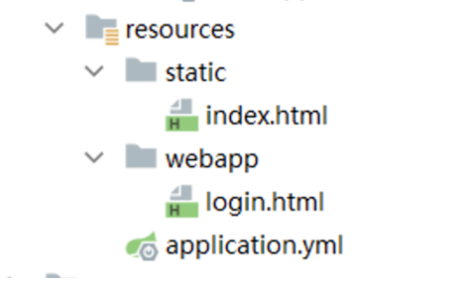

# 整合SpringMvc

# 一 实现过程

1. 导入依赖

```xml
<?xml version="1.0" encoding="UTF-8"?>
<project xmlns="http://maven.apache.org/POM/4.0.0"
         xmlns:xsi="http://www.w3.org/2001/XMLSchema-instance"
         xsi:schemaLocation="http://maven.apache.org/POM/4.0.0 http://maven.apache.org/xsd/maven-4.0.0.xsd">
    <modelVersion>4.0.0</modelVersion>
    
    <parent>
        <groupId>org.springframework.boot</groupId>
        <artifactId>spring-boot-starter-parent</artifactId>
        <version>3.0.5</version>
    </parent>

    <groupId>com.ls</groupId>
    <artifactId>springboot-base-springmvc-03</artifactId>
    <version>1.0-SNAPSHOT</version>

    <properties>
        <maven.compiler.source>17</maven.compiler.source>
        <maven.compiler.target>17</maven.compiler.target>
        <project.build.sourceEncoding>UTF-8</project.build.sourceEncoding>
    </properties>

    <dependencies>
        <dependency>
            <groupId>org.springframework.boot</groupId>
            <artifactId>spring-boot-starter-web</artifactId>
        </dependency>
    </dependencies>

</project>
```

2. 创建启动类

```java
@SpringBootApplication
public class Main {
    public static void main(String[] args) {
        SpringApplication.run(Main.class,args);
    }
}

```

3. 编写controller

```java
@RequestMapping("/hello")
@Controller
@ResponseBody
public class helloController {

    @GetMapping("/one")
    public String one(){
        return "Hello One!";
    }
}

```

4. 测试


# 二 Web相关配置

在application.yaml文件中，web相关的主要都在server下。

[Common Application Properties (spring.io)](https://docs.spring.io/spring-boot/docs/current/reference/html/application-properties.html#appendix.application-properties.core)

```yaml
# web相关的配置
# https://docs.spring.io/spring-boot/docs/current/reference/html/application-properties.html#appendix.application-properties.server
server:
  # 端口号设置
  port: 80
  # 项目根路径
  servlet:
    context-path: /boot
```


当涉及Spring Boot的Web应用程序配置时，以下是五个重要的配置参数：

1. `server.port`: 指定应用程序的HTTP服务器端口号。默认情况下，Spring Boot使用8080作为默认端口。您可以通过在配置文件中设置`server.port`来更改端口号。
2. `server.servlet.context-path`: 设置应用程序的上下文路径。这是应用程序在URL中的基本路径。默认情况下，上下文路径为空。您可以通过在配置文件中设置`server.servlet.context-path`属性来指定自定义的上下文路径。
3. `spring.mvc.view.prefix`和`spring.mvc.view.suffix`: 这两个属性用于配置视图解析器的前缀和后缀。视图解析器用于解析控制器返回的视图名称，并将其映射到实际的视图页面。`spring.mvc.view.prefix`定义视图的前缀，`spring.mvc.view.suffix`定义视图的后缀。
4. `spring.resources.static-locations`: 配置静态资源的位置。静态资源可以是CSS、JavaScript、图像等。默认情况下，Spring Boot会将静态资源放在`classpath:/static`目录下。您可以通过在配置文件中设置`spring.resources.static-locations`属性来自定义静态资源的位置。
5. `spring.http.encoding.charset`和`spring.http.encoding.enabled`: 这两个属性用于配置HTTP请求和响应的字符编码。`spring.http.encoding.charset`定义字符编码的名称（例如UTF-8），`spring.http.encoding.enabled`用于启用或禁用字符编码的自动配置。

这些是在Spring Boot的配置文件中与Web应用程序相关的一些重要配置参数。根据您的需求，您可以在配置文件中设置这些参数来定制和配置您的Web应用程序


# 三静态资源访问

在WEB开发中我们需要引入一些静态资源 , 例如 : HTML , CSS , JS , 图片等 , 如果是普通的项目静态资源可以放在项目的webapp目录下。现在使用Spring Boot做开发 , 项目中没有webapp目录 , 我们的项目是一个jar工程，那么就没有webapp，我们的静态资源该放哪里呢？

1. 默认路径

**默认的静态资源路径为：**

**· classpath:/META-INF/resources/**

**· classpath:/resources/**

**· classpath:/static/**

**· classpath:/public/**

我们只要静态资源放在这些目录中任何一个，SpringMVC都会帮我们处理。 我们习惯会把静态资源放在classpath:/static/ 目录下。在resources目录下创建index.html文件

访问： http://localhost:8080/index.html  注意，不需要写静态资源坐所在的文件夹。


2. 指定路径

```yaml
# web相关的配置
# https://docs.spring.io/spring-boot/docs/current/reference/html/application-properties.html#appendix.application-properties.server
server:
  # 端口号设置
  port: 80
  # 项目根路径
  servlet:
    context-path: /boot
spring:
  web:
    resources:
      # 配置静态资源地址,如果设置,会覆盖默认值
      static-locations: classpath:/webapp
```



访问地址：http://localhost/boot/login.html

