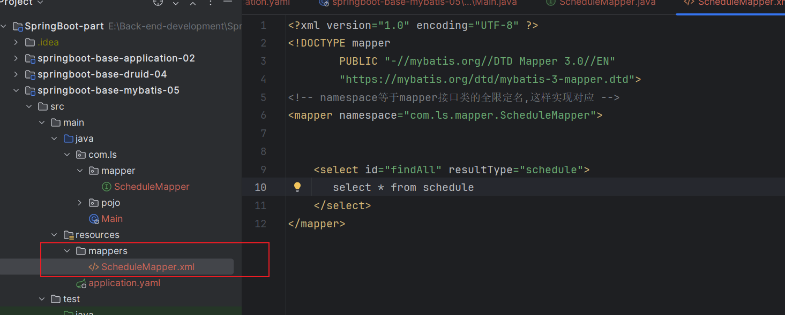
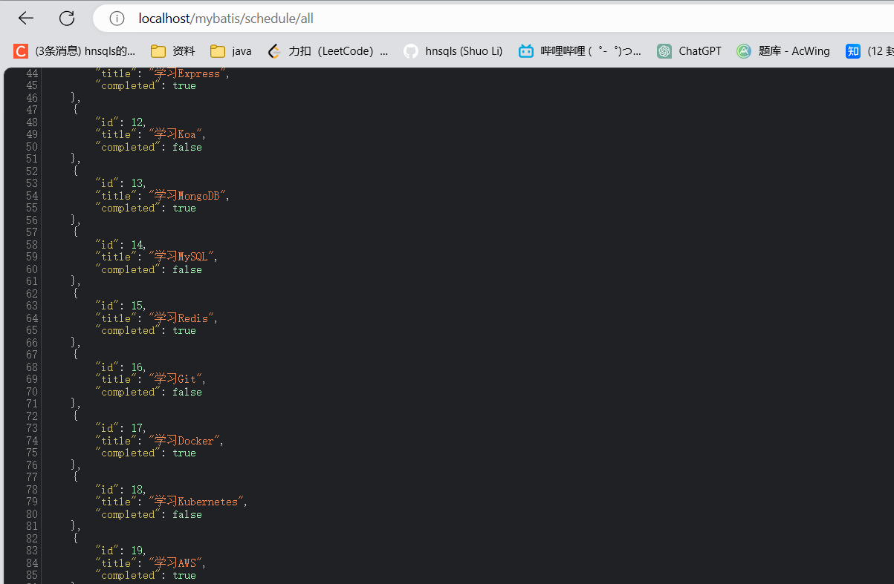

# 整合Mybatis

* 引入mybatis提供的启动器
* 配置文件中配置mybatis相关属性
* 在启动类扫描mapper接口
* 配置数据源


1. 引入依赖

```xml
<?xml version="1.0" encoding="UTF-8"?>
<project xmlns="http://maven.apache.org/POM/4.0.0"
         xmlns:xsi="http://www.w3.org/2001/XMLSchema-instance"
         xsi:schemaLocation="http://maven.apache.org/POM/4.0.0 http://maven.apache.org/xsd/maven-4.0.0.xsd">
    <modelVersion>4.0.0</modelVersion>

    <parent>
        <groupId>org.springframework.boot</groupId>
        <artifactId>spring-boot-starter-parent</artifactId>
        <version>3.0.5</version>
    </parent>
    <groupId>com.ls</groupId>
    <artifactId>springboot-base-mybatis-05</artifactId>
    <version>1.0-SNAPSHOT</version>

    <properties>
        <maven.compiler.source>17</maven.compiler.source>
        <maven.compiler.target>17</maven.compiler.target>
        <project.build.sourceEncoding>UTF-8</project.build.sourceEncoding>
    </properties>

    <dependencies>
        <dependency>
            <groupId>org.springframework.boot</groupId>
            <artifactId>spring-boot-starter-web</artifactId>
        </dependency>

        <dependency>
            <groupId>org.mybatis.spring.boot</groupId>
            <artifactId>mybatis-spring-boot-starter</artifactId>
            <version>3.0.1</version>
        </dependency>

        <!-- 数据库相关配置启动器 -->
        <dependency>
            <groupId>org.springframework.boot</groupId>
            <artifactId>spring-boot-starter-jdbc</artifactId>
        </dependency>

        <!-- druid启动器的依赖  -->
        <dependency>
            <groupId>com.alibaba</groupId>
            <artifactId>druid-spring-boot-3-starter</artifactId>
            <version>1.2.20</version>
        </dependency>

        <!-- 驱动类-->
        <dependency>
            <groupId>mysql</groupId>
            <artifactId>mysql-connector-java</artifactId>
            <version>8.0.28</version>
        </dependency>

        <dependency>
            <groupId>org.projectlombok</groupId>
            <artifactId>lombok</artifactId>
            <version>1.18.30</version>
        </dependency>

    </dependencies>

</project>
```

2. 配置文件

```yaml
server:
  port: 80
  servlet:
    context-path: /mybatis

spring:
  datasource:
    # 连接池类型
    type: com.alibaba.druid.pool.DruidDataSource

    # Druid的其他属性配置 springboot3整合情况下,数据库连接信息必须在Druid属性下!
    druid:
      url: jdbc:mysql://localhost:3306/mybatis-example
      username: root
      password: root
      driver-class-name: com.mysql.cj.jdbc.Driver


mybatis:
  configuration:
    auto-mapping-behavior: full
    map-underscore-to-camel-case: true
    log-impl: org.apache.ibatis.logging.slf4j.Slf4jImpl
  type-aliases-package: com.ls.pojo
  mapper-locations: classpath:/mappers/*.xml # 扫描 mapperxml文件的位置。
```

3. pojo

```java
@Data
public class Schedule {
    private Integer id;
    private String title;
    boolean completed;
}
```

4. mapper

```java
public interface  ScheduleMapper {
    List<Schedule> findAll();
}

```

5. mapper.xml

resource/mappers/

路径不在像SSM整合时，ConfigruSCanner类的扫包的方法，要求在同一个包。

在springboot的配置文件中，可以指定mapper.xml的位置。在配合上启动类上的@MapperScan注解扫描接口。共同作用生成代理并加到容器中。



需要注意的是：在配置文件中一定要指定到mapper.xml文件的位置，而非所在的文件夹。

6. service

```java
public interface ScheduleService {
    List<Schedule> findAll();
}

@Service
public class ScheduleServiceImp implements ScheduleService {
    @Resource
    private ScheduleMapper scheduleMapper;
    @Override
    public List<Schedule> findAll() {
        List<Schedule> scheduleList = scheduleMapper.findAll();
        return scheduleList;
    }
}

```

7. controller

```java
@RestController
@RequestMapping("/schedule")
public class ScheduleController {

    @Autowired
    private ScheduleService scheduleService;
    @GetMapping("/all")
    public List<Schedule> find(){
        List<Schedule> scheduleList = scheduleService.findAll();
        System.out.println("scheduleList = " + scheduleList);
        return scheduleList;
    }
}
```

8. 启动类

```java
@SpringBootApplication
@MapperScan("com.ls.mapper")  //扫描mapper接口，配合配置类中mapper.xml生成代理类，并放入root容器
public class Main {
    public static void main(String[] args) {
        SpringApplication.run(Main.class,args);
    }
}
```

9. 请求测试

http:localhost:80/mybatis/schedule/all




**总结**：

* 导入mybatis提供的stater
* 配置mybatis
* 启动类配置mapper接口扫描。